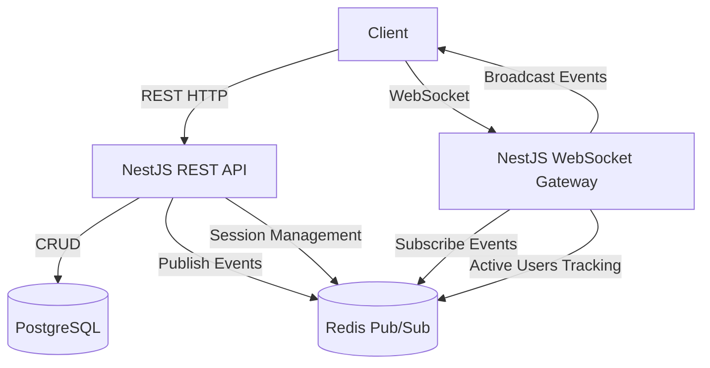

# Architecture Document

## Architecture Overview

The system is built as a highly scalable, stateless NestJS backend API that interfaces with PostgreSQL (via Drizzle ORM) for persistent data storage and Redis for ephemeral state (sessions, active users) and real-time message broadcasting.

## Session Strategy
- **Token Generation**: A 64-character hex string is securely generated via `crypto.randomBytes(32)` upon login.
- **Storage**: Sessions are stored exclusively in Redis using the key pattern `session:<token>`. They contain the user's ID, username, and creation timestamp.
- **Expiry**: Redis keys natively handle the 24-hour expiration (`EX` set to 86400).
- **Validation**: An `AuthGuard` on REST endpoints and connection interceptors in WebSockets validate the incoming `Bearer <token>` against Redis. Invalid tokens result in `401 Unauthorized` errors.

## WebSocket Fan-out with Redis Pub/Sub
To scale WebSockets across multiple server instances horizontally, we utilize the `@socket.io/redis-adapter` alongside direct Redis `publish/subscribe`.
1. When a user posts a message via the REST API, the API persists it to Postgres and then publishes a `message:new` payload to a Redis channel `chat_events`.
2. Every WebSocket Gateway instance subscribes to `chat_events`. When an instance receives the broadcast, it pushes the `message:new` event directly to its connected clients within the specified `roomId`.
3. Additionally, Socket.io's native Redis adapter natively handles syncing typical `room:joined` or `room:user_left` events across the cluster.

## Estimated Concurrent User Capacity
- **Single Node Capacity**: Assuming a standard 2 vCPU / 4GB RAM instance, Node.js + Socket.io can typically handle around **10,000 to 20,000 concurrent WebSocket connections** smoothly if message throughput is moderate.
- **Reasoning**: The main bottlenecks are open file descriptors, TCP ports, and Node.js event loop blocking. Because all intensive data operations (DB reads/writes, session lookups) are heavily offloaded to I/O and Redis, the Node process remains CPU-efficient. Memory footprint per Socket.io connection is roughly 20-50KB, meaning 20k users consume ~1GB of RAM. 

## Scaling to 10x Load
If traffic were to increase by 10x (e.g., 200,000 concurrent users), the following adjustments are necessary:
1. **Horizontal Pod Autoscaling**: Run 10-20 instances of the NestJS application behind a Layer 7 Load Balancer (e.g., AWS ALB or NGINX) configured for WebSocket sticky sessions.
2. **Redis Clustering**: Upgrade the single Redis instance to a Redis Cluster or use a managed service like AWS ElastiCache to handle the exponential increase in pub/sub message throughput.
3. **Database Connection Pooling**: PostgreSQL connections would become a bottleneck. We would introduce `PgBouncer` to multiplex thousands of client connections onto a smaller pool of actual Postgres connections.
4. **Read Replicas**: For the `GET /rooms` and `GET /messages` queries, direct traffic to read replicas, keeping the primary instance dedicated to writes.

## Known Limitations and Trade-offs
1. **Cursor Pagination**: The current pagination uses `id` combined with `createdAt` sorting. For extreme precision in high-throughput environments, a purely keyset/sequence-based cursor mechanism would be safer.
2. **Missing Rate Limiting**: The system currently does not throttle REST endpoints or WebSocket message emissions, making it susceptible to spam/DDoS.
3. **Orphaned Sessions/Users**: If the Node server crashes abruptly before `handleDisconnect` fires, active users might be left in the Redis `room_active_users` sets until a cleanup job removes them. A periodic heartbeat check could mitigate this.
